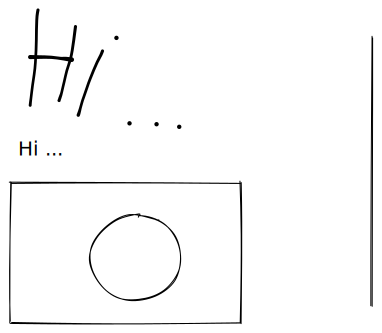

# Export Sucess

#### EXPORTED

* [ ] TASK1
* [ ] TASK2

```vbnet
Using System.IO
MsgBox("Hello")
```



### TAB1

1. LISTITEM1
2. LISTITEM2
3. LISTITEM3



### TAB2





| Input          | Process             | Output                |
| -------------- | ------------------- | --------------------- |
| Tweak Variable | Determine Tweak TAG | Change Panel Settings |
| V2.            | P2                  | O2                    |
| V3             | P3                  | O3                    |

### LINK BELOW (Previous Page)


[.](./)

